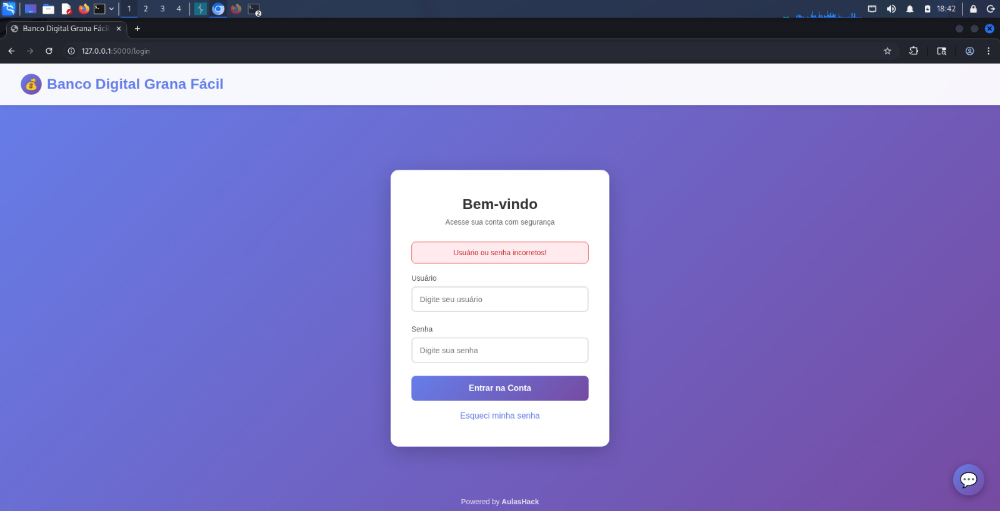
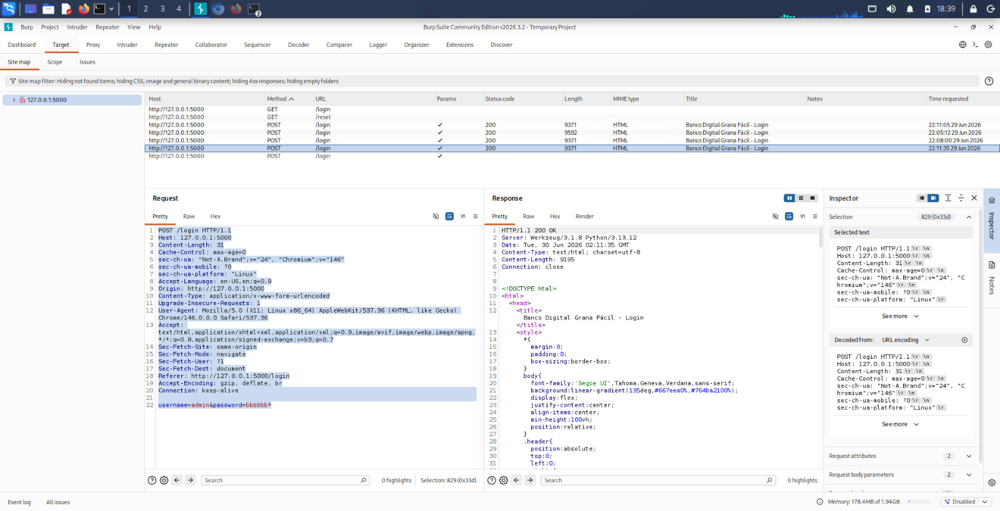
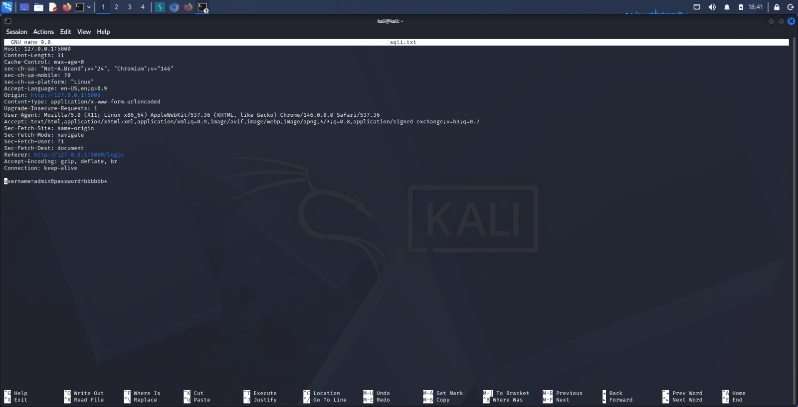
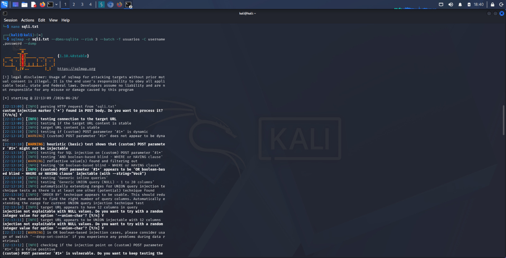
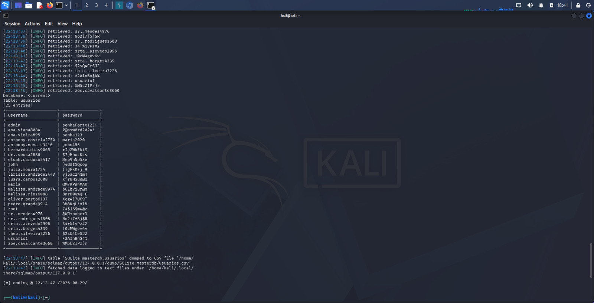

# SQL Injection Lab Study

## Sobre

Este repositório documenta meus estudos sobre SQL Injection realizados em um ambiente de laboratório.

O laboratório foi desenvolvido pelo canal **AulasHack**, no curso **Dominando o Pentest Web**, sendo utilizado exclusivamente para fins educacionais.

O objetivo deste projeto foi compreender como uma vulnerabilidade de SQL Injection pode ser identificada, explorada e, principalmente, como pode ser corrigida.

---

## Ferramentas utilizadas

- Kali Linux
- Burp Suite Community
- sqlmap
- SQLite

---

## Etapas realizadas

### 1. Acesso ao laboratório

Foi realizado o acesso ao sistema vulnerável disponibilizado durante o curso.

---

### 2. Interceptação da requisição

Utilizei o Burp Suite para interceptar a requisição enviada pelo formulário de login.

---

### 3. Exportação da requisição

A requisição HTTP foi salva em um arquivo para utilização no sqlmap.

---

### 4. Teste da vulnerabilidade

O sqlmap identificou uma vulnerabilidade de SQL Injection.

---

### 5. Resultado

Foi demonstrado o impacto da vulnerabilidade em ambiente controlado.

> As informações sensíveis foram ocultadas nesta documentação.

---

## Aprendizados

- Interceptação de requisições HTTP
- SQL Injection
- Burp Suite
- sqlmap
- SQLite
- Segurança em aplicações Web
- Importância de Prepared Statements

---

## Aviso

Este estudo foi realizado **exclusivamente em ambiente de laboratório autorizado**, com finalidade educacional.

Todo o crédito pelo laboratório pertence ao canal **AulasHack** e ao curso **Dominando o Pentest Web**.

---

## 🛡️ Prevenção e limites do estudo

Este projeto documenta a identificação e a exploração de SQL Injection em um laboratório autorizado. A implementação e o teste de uma correção ainda não fazem parte deste estudo.

A principal medida de prevenção é utilizar consultas parametrizadas, mantendo os valores recebidos do usuário separados da estrutura do comando SQL.

Outras medidas complementares incluem:

- Validar as entradas conforme as regras da aplicação.
- Limitar as permissões da conta utilizada para acessar o banco.
- Evitar expor detalhes internos do banco em mensagens de erro.

A validação de entradas não substitui o uso de consultas parametrizadas.

### Próxima etapa

Criar um exemplo local comparando uma consulta vulnerável com uma versão parametrizada e verificar o comportamento das duas implementações.
